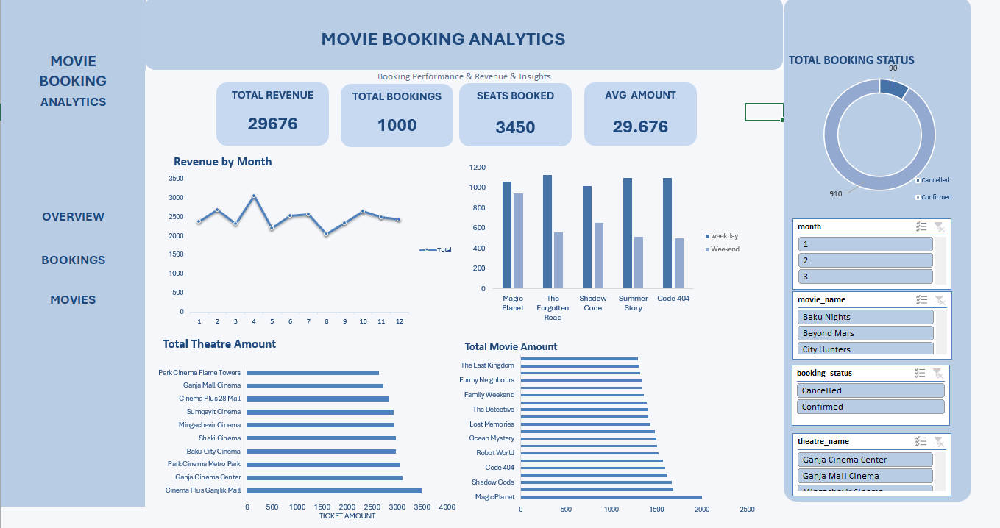
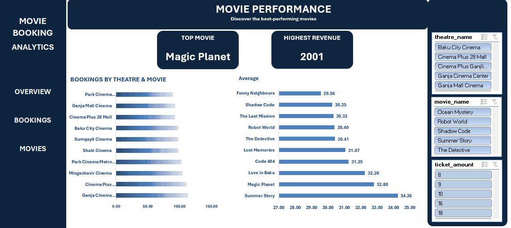
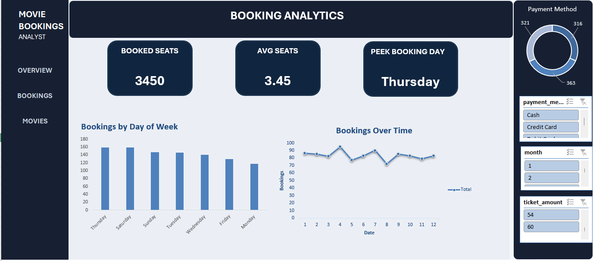

# Theatre Booking Analytics

A data analytics project focused on analyzing theatre ticket bookings, customer activity, revenue, and booking patterns using SQL, Python, and Excel.

## Project Overview

This project analyzes theatre booking data stored in a MySQL database. Python is used for data processing, analysis, and visualization, while Excel is used to create the final dashboard.

### Project Workflow

**MySQL → Python (Pandas & Matplotlib) →Excel Dashboard**

## Technologies

* **MySQL** — database creation, data storage, and SQL analysis
* **Python** — data processing and analysis
* **Pandas** — data manipulation
* **Matplotlib** — data visualization
* **Excel** — dashboard and KPI reporting

## Analysis

The project explores several aspects of theatre booking data, including:

* Total number of bookings
* Total booking revenue
* Average booking value
* Customer booking activity
* Popular movies and shows
* Booking trends over time
* Revenue distribution
* Booking patterns

## Dashboard

The Excel dashboard presents the main results using KPIs, charts, and interactive filters.

### Overview



### Movies Analysis



### Booking Analysis



## Project Structure

```text
Theatre-Booking-Analytics/
│
├── moviedb1.sql
├── movie.py
├── theatre_dashboard.xlsx
├── overview.png
├── movies.png
├── booking.png
└── README.md
```

## Key Skills Demonstrated

* SQL querying and relational database analysis
* Data cleaning and preparation
* Exploratory data analysis
* Data visualization
* KPI analysis
* Excel dashboard development
* Working with structured business data

## Project Purpose

The goal of this project was to practice an end-to-end data analytics workflow, starting with a relational database and SQL analysis, continuing with Python-based data analysis, and finishing with an Excel dashboard.
